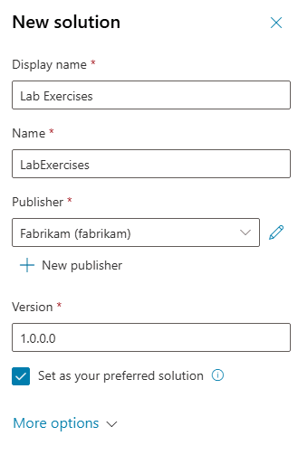

---
lab:
  title: ILT Setup
  module: Introduction
  description: In this exercise, you will access the Microsoft Copilot Studio portal and create an environment and solution to use throughout the remaining labs.
  duration: 10 minutes
  level: 200
  islab: true
  primarytopics:
    - Microsoft Copilot
    - Microsoft Copilot Studio
---

## Exercise 1 - Access Copilot Studio

### Task 1.1 - Create a solution

1. In the left navigation pane, select the ellipses (**...**), and select **Solutions**.

1. You should see several solutions including the *Default Solution* and the *Common Data Services Default Solution*.

   

1. Select **+ New solution**.

1. In the **Display name** text box, enter **`Lab Exercises`**

1. Verify that **Name** is automatically populated.

1. Select **+ New publisher** below the **Publisher** drop-down.

1. For **Display name**, enter `Fabrikam`

1. For **Name**, enter `fabrikam`

1. For **Prefix**, enter `fab`

   

1. Select **Save**.

1. Verify that **Fabrikam (fabrikam)** is selected in the **Publisher** drop-down.

1. Select the **Set as your preferred solution** checkbox.

   > [!NOTE]
   > Setting this as your preferred solution ensures new assets created during later labs are added to the Lab Exercises solution by default.

   

1. Select **Create**.

1. Close the **Solutions** browser tab.

1. Refresh the **Copilot Studio** page.

You now have a Power Platform environment and solution to work in.
